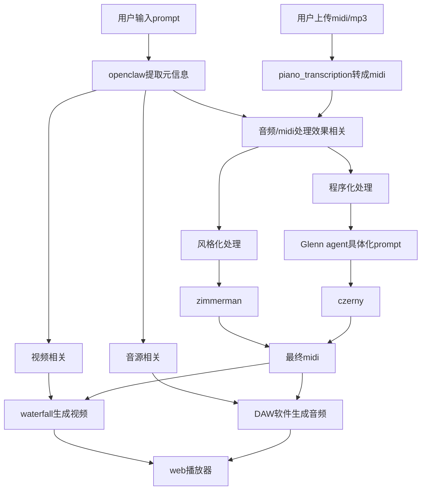

## 流程图

```mermaid
graph TD
   A[用户上传midi/mp3] --> C[piano_transcription转成midi]
   B[用户输入prompt] --> D[openclaw提取元信息]
	D --> E[音频/midi处理效果相关]
    C --> E
    D --> K[视频相关]
    D --> L[音源相关]
   E --> F[风格化处理]
   F --> J[zimmerman]
   E --> G[程序化处理]
   G --> H[Glenn agent具体化prompt]
   H --> I[czerny]
   K --> M[waterfall生成视频]
   J --> P[最终midi]
   I --> P
   L --> N[DAW软件生成音频]
   P --> N
   P --> M
   M --> O[web播放器]
   N --> O
```

## TODO
### openclaw skills:

### DAW软件

### glenn agent 音频切片
确定在某个位置割开，不同部分能够有不同的处理效果

## 突发奇想

#### 找开放的音频库、midi库放在网站上，用户在prompt里说"生成拉赫弹利盖蒂的练习曲"可以直接调用音频库

#### 提取agent的部分输出，在前端展示给用户
